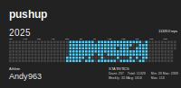
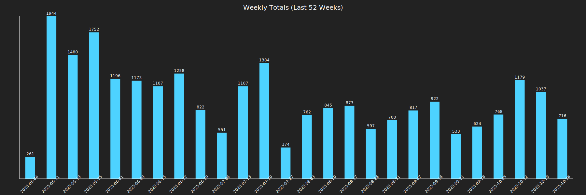
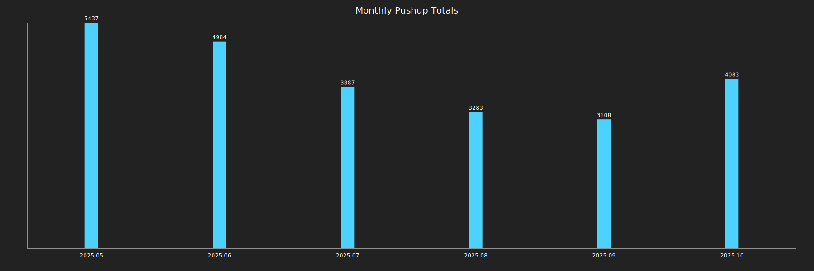

## 
魔改的 [yihong](https://github.com/yihong0618/running_page) 大哥的，因为我不跑步，只做俯卧撑，改成了俯卧撑主页。

使用用的 App:Puuush, 需要分享到strava.







## 它是怎么工作的


## 特性

1. GitHub Actions 自动同步跑步数据，生成展示页面
2. Strava自动备份 GPX 数据，方便备份及上传到其它软件

> 因为数据存在 gpx 和 data.db 中，理论上支持几个软件一起，你可以把之前各类 App 的数据都同步到这里（建议本地同步，之后 Actions 选择正在用的 App）
>
> 如果你不想公开数据，可以选择 `Strava` 的模糊处理，或 `private` 仓库。

## 支持

- **[Strava](#strava)**

## 下载

```bash
git clone https://github.com/yihong0618/running_page.git --depth=1
```

## 安装及测试 (node >= 20 python >= 3.11)

```bash
pip3 install -r requirements.txt
npm install -g corepack && corepack enable && pnpm install
pnpm develop
```


## 下载数据到本地

> 下载您的 Nike Run Club/Strava/Garmin/Garmin-cn/Keep 数据到本地，别忘了在 total 页面生成可视化 SVG


> Please note:由于 nike run club 已经在中国大陆停止运营，所以只能通过 vpn 的方式进行登录。在开始之前先确认自己是全局的非中国大陆的代理，能够正确的访问`nike.com`而不是`nike.com.cn` 如下图所示。

### Strava

<details>
<summary>获取 Strava 数据</summary>

<br>

1. 注册/登陆 [Strava](https://www.strava.com/) 账号
2. 登陆成功后打开 [Strava Developers](http://developers.strava.com) -> [Create & Manage Your App](https://strava.com/settings/api)

3. 创建 `My API Application`
   输入下列信息：
   
   创建成功：
   
4. 使用以下链接请求所有权限
   将 ${your_id} 替换为 My API Application 中的 Client ID 后访问完整链接

   ```plaintext
   https://www.strava.com/oauth/authorize?client_id=${your_id}&response_type=code&redirect_uri=http://localhost/exchange_token&approval_prompt=force&scope=read_all,profile:read_all,activity:read_all,profile:write,activity:write
   ```

   Example:

   ```plaintext
   https://www.strava.com/oauth/authorize?client_id=115321&response_type=code&redirect_uri=http://localhost/exchange_token&approval_prompt=force&scope=read_all,profile:read_all,activity:read_all,profile:write,activity:write
   ```

   

5. 提取授权后返回链接中的 code 值
   例如：

   ```plaintext
   http://localhost/exchange_token?state=&code=1dab37edd9970971fb502c9efdd087f4f3471e6e&scope=read,activity:write,activity:read_all,profile:write,profile:read_all,read_all
   ```

   `code` 数值为：

   ```plaintext
   1dab37edd9970971fb502c9efdd087f4f3471e6
   ```

    6. 使用 Client_id、Client_secret、Code 请求 refresh_token
   在 `终端/iTerm` 中执行：

   ```bash
   curl -X POST https://www.strava.com/oauth/token \
   -F client_id=${Your Client ID} \
   -F client_secret=${Your Client Secret} \
   -F code=${Your Code} \
   -F grant_type=authorization_code
   ```

   示例：

   ```bash
   curl -X POST https://www.strava.com/oauth/token \
   -F client_id=12345 \
   -F client_secret=b21******d0bfb377998ed1ac3b0 \
   -F code=d09******b58abface48003 \
   -F grant_type=authorization_code
   ```

   

6. 同步数据至 Strava
   在项目根目录执行：

   ```bash
   pdm run sync ${client_id} ${client_secret} ${refresh_token}
   ```

   或者使用环境变量（GitHub Actions 也使用这组变量名）：

   ```bash
   export CLIENT_ID=...
   export CLIENT_SECRET=...
   export REFRESH_TOKEN=...
   pdm run sync
   ```

   可选：通过 `--start-date` 覆盖同步起始时间（默认会从数据库最近一条活动之后开始同步）。

   其他资料参见
   <https://developers.strava.com/docs/getting-started>
   <https://github.com/barrald/strava-uploader>
   <https://github.com/strava/go.strava>

</details>


## GitHub Actions

> Fork 的同学请一定不要忘了把 GitHub Token 改成自己的，否则会 push 到我的 repo 中，谢谢大家。

<details>
<summary>修改 GitHub Actions Token</summary>

<br>

Actions [源码](https://github.com/yihong0618/running_page/blob/master/.github/workflows/run_data_sync.yml)
需要做如下步骤

1. 更改成你的 app type 及 info

   

2. 在 `repo Settings` > `Secrets` 中增加你的 secret (只添加你需要的即可)

   

   我的 secret 如下

   

</details>

## 快捷指令

<details>

<summary>使用 iOS 的 Shortcuts 实现自动化</summary>

<br>

下面拿 keep app 举例，当结束跑步后关闭 app，然后自动触发 Actions 更新数据。

1. 拿到项目的 actions id（需要自行申请 token）

   ```shell
   curl https://api.github.com/repos/yihong0618/running_page/actions/workflows -H "Authorization: token d8xxxxxxxxxx" # change to your config
   ```

   <center></center>

2. 结合快捷指令
   1. 通过 iCloud 获取 [running-page-shortcuts-template](https://www.icloud.com/shortcuts/4a5807a98b9a4e359815ff179c62bacb)
   2. 修改下图字典参数

   <center>  </center>

3. 自动化

<center>


</center>

</details>

## GitHub Cache

<details>
<summary>把数据文件放在 GitHub Cache 中</summary>

<br>

`run_data_sync.yml` 中的 `SAVE_DATA_IN_GITHUB_CACHE` 设置为 `true` 时，可以把脚本抓取和中间产生的数据文件放到 GitHub Actions Cache 中。这样可以让你的 GitHub commit 历史和目录保持干净。

如果你用 `GitHub Pages` 部署建议把这个值设置成 `true`。

</details>


# 参与项目

- 任何 Issues PR 均欢迎。
- 可以提交 PR share 自己的 Running page 在 README 中。
- 提交 PR 前，使用 black 对 Python 代码进行格式化。(`black .`)

# 特别感谢

- @[flopp](https://github.com/flopp) 特别棒的项目 [GpxTrackPoster](https://github.com/flopp/GpxTrackPoster)
- @[danpalmer](https://github.com/danpalmer) 原始的 UI 设计
- @[shaonianche](https://github.com/shaonianche) icon 设计及文档
- @[geekplux](https://github.com/geekplux) 帮助及鼓励，重构了前端代码，学到了不少
- @[ben-29](https://github.com/ben-29) 搞定了咕咚，和我一起搞定了悦跑圈，太厉害了
- @[MFYDev](https://github.com/MFYDev) Wiki

# 推荐的 Forks

- @[gongzili456](https://github.com/gongzili456) for [摩托车骑行版本](https://github.com/gongzili456/running_page)
- @[ben-29](https://github.com/ben-29) for [多种运动类型支持](https://github.com/ben-29/workouts_page)
- @[geekplux](https://github.com/geekplux) for [多种运动类型支持](https://github.com/geekplux/activities)


# FAQ

- Strava 100 每 15 分钟的请求，1000 每日限制

  <https://www.strava.com/settings/api>
  <https://developers.strava.com/docs/#rate-limiting>

  等待时间限制（这里是 strava 接口请求限制），不要关闭终端，这里会自动执行下一组上传数据

  ```plaintext
  Strava API Rate Limit Exceeded. Retry after 100 seconds
  Strava API Rate Limit Timeout. Retry in 799.491622 seconds
  ```

- vercel git

  如果想 ignore gh-pages 可以在 `settings` -> `build` -> `Ignored Build Step` -> `Custom` 输入命令：

  ```bash
  if [ "$VERCEL_GIT_COMMIT_REF" != "gh-pages" ]; then exit 1; else exit 0;
  ```
